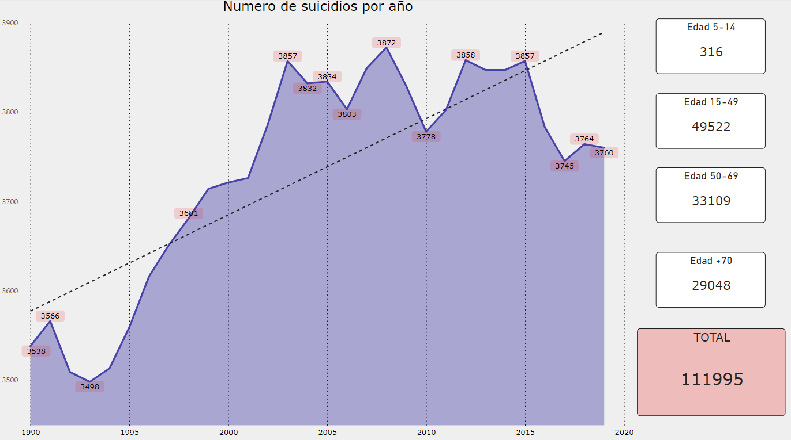

# Tasa Suicidios

Nos enfrentamos a un desafío sin precedentes: la "pandemia silenciosa", donde la salud mental emerge como una preocupación primordial.

En el estudio realizado, se ha analizado el histórico de suicidios en España, revelando una realidad alarmante y urgente.
La falta de visibilidad y recursos para abordar esta pandemia silenciosa, así como la insuficiente inversión en salud mental, son evidentes. Es doloroso constatar cómo estas cifras siguen en aumento sin que se tomen medidas efectivas. La salud mental no puede ser relegada a una mención ocasional en el Día Mundial correspondiente, solo para ser olvidada después.

Resulta evidente cómo el funcionamiento socioeconómico impacta directamente en estos números. Por ejemplo, el año con el mayor número de suicidios, 2008, coincide con el inicio de la "Gran Recesión Española", la explosión de la burbuja inmobiliaria y el aumento del desempleo.

Observamos cómo, a pesar de los avances tecnológicos y sociales, persisten los problemas económicos y de bienestar. En pleno 2024, la tendencia al alza en las cifras de suicidio no muestra signos de disminuir, mientras que la inversión en salud mental sigue siendo insuficiente.

Es fundamental que se reconozca el suicidio como un problema de salud pública, es hora de destinar recursos y esfuerzos significativos a la promoción y protección de la salud mental en nuestra sociedad.  
